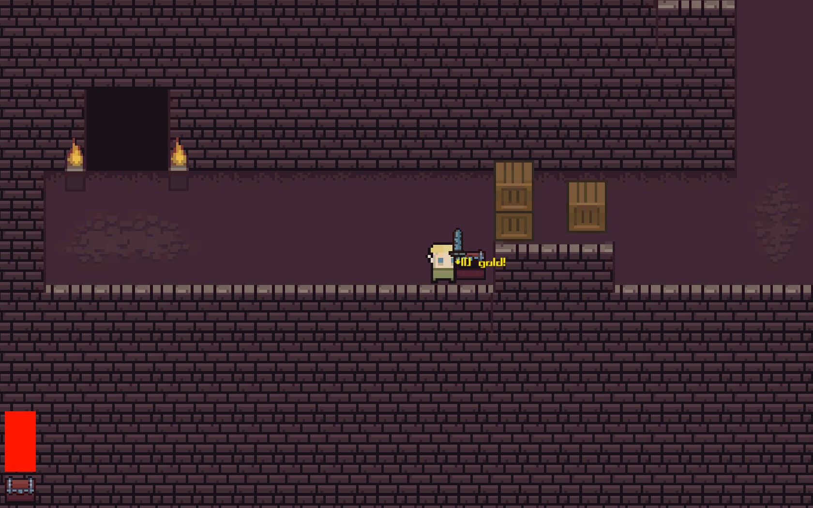
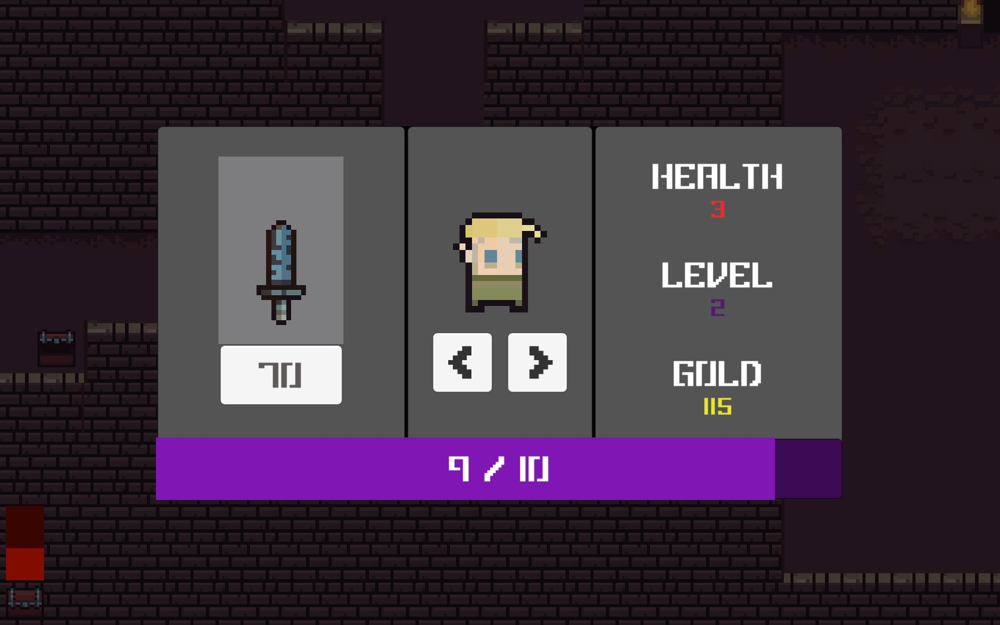

## 🎮 Try it out!
You can play it here 

  
## ℹ️ General info

The main purpose of creating this game was to strengthen my C# programming skills and get to know [Unity](https://unity.com/) game engine. I was following [this](https://www.youtube.com/watch?v=b8YUfee_pzc), nearly 8-hour tutorial on YouTube (I've made a few of my own minor changes and tweaks after finishing, so it's not exactly the same as in the video).

## ⌨️ Controls

* Arrows - movement
* Spacebar - attack
* ESC - Menu (or click chest icon in bottom left corner)

## 💻 Technologies and tools used
* C# 9.0
* Unity 2021.3.5f1
* Visual Studio 2022

## 📷 Screenshots

